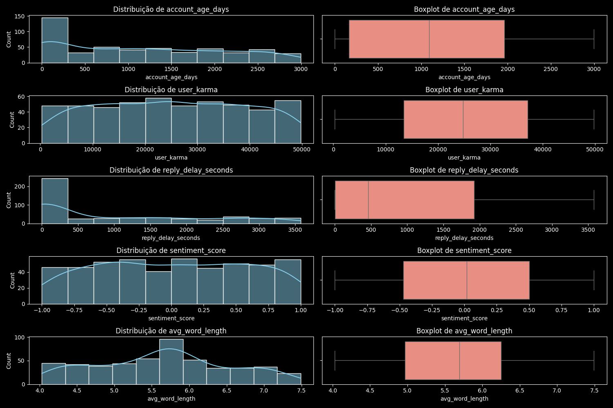
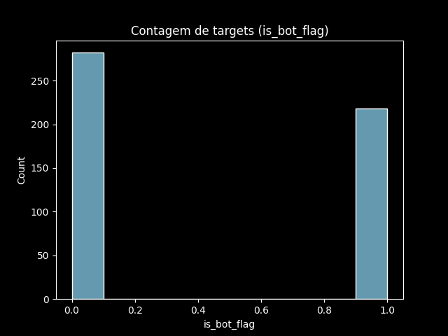

## A base de dados
A base de dados escolhida foi a [The "Dead Internet" Theory: Reddit Bot vs. Human](https://www.kaggle.com/datasets/nudratabbas/the-dead-internet-theory-reddit-bot-vs-human?resource=download), onde cada registro (linha) representa metadados sintéticos de comentários encontrados no reddit (500 registros de 2026). O objetivo dessa análise é classificar o comentário entre "Bot" ou "Human". A base de dados é composta por 10 colunas, sendo elas:
- comment_id: identificador único do comentário;
- subreddit: nome do subreddit onde o comentário foi postado;
- account_age_days: idade da conta do usuário em dias;
- user_karma: karma do usuário (pontuação que reflete a popularidade do usuário no reddit);
- reply_delay_seconds: tempo em segundos entre a postagem original e a resposta publicada;
- sentiment_score: pontuação de sentimento do comentário, variando de -1 (muito negativo) a 1 (muito positivo), revelando a emoção expressa no comentário;
- avg_word_length: comprimento médio das palavras usadas no comentário, indicando a complexidade do vocabulário;
- contains_links: indicador binário (0 ou 1) que mostra se o comentário contém links, o que pode ser um sinal de comportamento de bot;
- is_bot_flag: indicador binário (0 ou 1) que indica se o comentário foi classificado como "Bot" (1) ou "Human" (0), sendo a variável alvo para a classificação;
- bot_type_label: rótulo categórico que especifica o tipo de bot, caso o comentário seja classificado como "Bot". Os tipos de bots podem incluir categorias como " Reprint Bot", "AI Summarizer", "Engagement Farmer" ou "None (Human)".

## Exploração dos dados

### Dados nulos: 
A base não contém dados ausentes.

### Dsitribuição das variáveis:
Através da plotagem de histogramas, foi observado que as variáveis numéricas não seguem uma distribuição normal (informação relevante para o pré processamento), onde "user_karma", "sentiment_score" e "avg_word_lenght" apresentam uma distribuição quase simétrica, enquanto "account_age_days" e "reply_delay_seconds" apresentam uma distribuição assimétrica à direita.
.

### Presença de Outliers:
Através da plotagem de boxplots (imagem acima) foi possível observar que não há presença de outliers nas variáveis numéricas.

### Distribuição da variável alvo:
A variável alvo "is_bot_flag" apresenta uma distribuição balanceada, onde 282 amostras são de humanos e 218 são bots.
.

