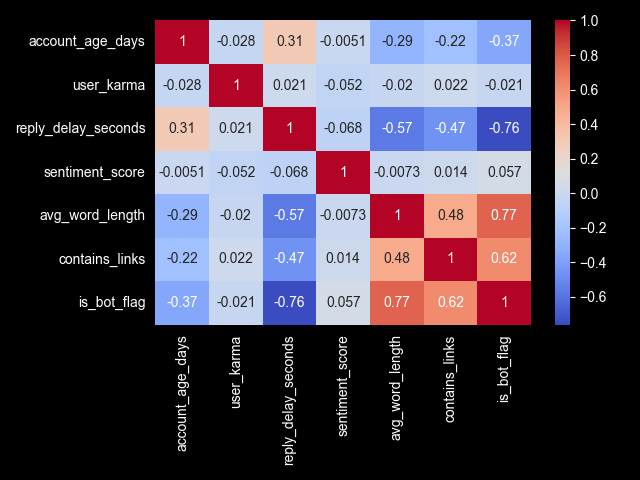
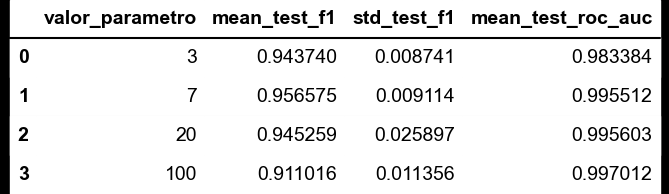
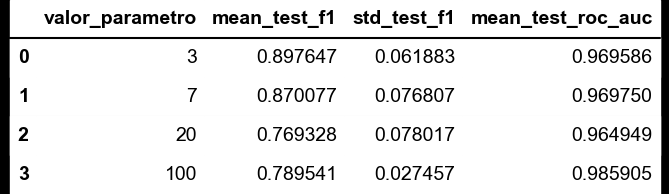
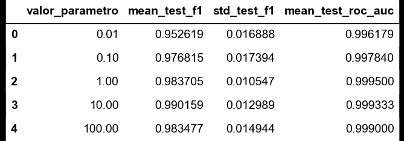
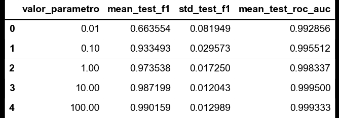
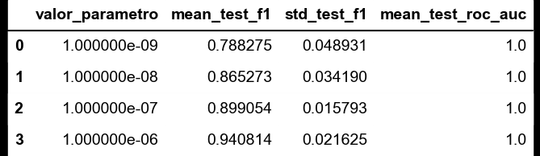
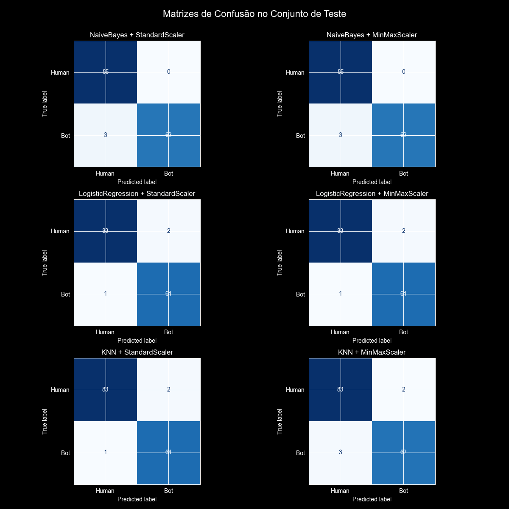
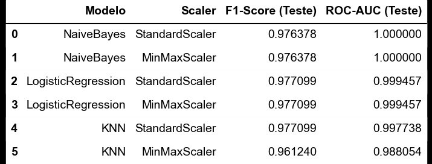

## A base de dados
A base de dados escolhida foi a [The "Dead Internet" Theory: Reddit Bot vs. Human](https://www.kaggle.com/datasets/nudratabbas/the-dead-internet-theory-reddit-bot-vs-human?resource=download), onde cada registro (linha) representa metadados sintéticos de comentários encontrados no reddit (500 registros de 2026). O objetivo dessa análise é classificar o comentário entre "Bot" ou "Human". A base de dados é composta por 10 colunas, sendo elas:
- comment_id: identificador único do comentário;
- subreddit: nome do subreddit onde o comentário foi postado;
- account_age_days: idade da conta do usuário em dias;
- user_karma: karma do usuário (pontuação que reflete a popularidade do usuário no reddit);
- reply_delay_seconds: tempo em segundos entre a postagem original e a resposta publicada;
- sentiment_score: pontuação de sentimento do comentário, variando de -1 (muito negativo) a 1 (muito positivo), revelando a emoção expressa no comentário;
- avg_word_length: comprimento médio das palavras usadas no comentário, indicando a complexidade do vocabulário;
- contains_links: indicador binário (0 ou 1) que mostra se o comentário contém links, o que pode ser um sinal de comportamento de bot;
- is_bot_flag: indicador binário (0 ou 1) que indica se o comentário foi classificado como "Bot" (1) ou "Human" (0), sendo a variável alvo para a classificação;
- bot_type_label: rótulo categórico que especifica o tipo de bot, caso o comentário seja classificado como "Bot". Os tipos de bots podem incluir categorias como " Reprint Bot", "AI Summarizer", "Engagement Farmer" ou "None (Human)".

## Exploração dos dados

### Dados nulos: 
A base não contém dados ausentes.

### Dsitribuição das variáveis:
Através da plotagem de histogramas, foi observado que as variáveis numéricas não seguem uma distribuição normal (informação relevante para o pré processamento), onde "user_karma", "sentiment_score" e "avg_word_lenght" apresentam uma distribuição quase simétrica, enquanto "account_age_days" e "reply_delay_seconds" apresentam uma distribuição assimétrica à direita.
.

### Presença de Outliers:
Através da plotagem de boxplots (imagem acima) foi possível observar que não há presença de outliers nas variáveis numéricas.

### Distribuição da variável alvo:
A variável alvo "is_bot_flag" apresenta uma distribuição balanceada, onde 282 amostras são de humanos e 218 são bots.
.

### Correlação entre as variáveis:
Através da plotagem de um mapa de calor, foi possivel observar que as variáveis numéricas, em geral, apresentam uma forte correlação com a variável alvo, em especial "reply_delay_seconds", "avg_word_lenght" e "contain_links", revelando que podem ser importantes para a classificação.
.

## Pré-Processamento:

Variáveis Removidas:
comment_id (identificador sem poder preditivo)
bot_type_label (redundante com alvo)
bot_probability (derivada da variável alvo)_

Codificação de Variáveis Categóricas:
A variável 'subreddit' foi transformada utilizando One-Hot Encoding, resultando em 6 novas colunas ('funny', 'gaming', 'politics', 'worldnews', 'technology', 'pics').

A ausência de outliers, valores nulos e duplicados, juntamente com a base balanceada e variáveis fortemente relacionadas permitiu com que o pré-processamento fosse simples. 

Para as variáveis numéricas, optamos por utilizar as técnicas de padronização (StandardScaler) e normalização (MinMaxScaler) para termos uma comparação do quanto isso impactaria no resultado final.

## Cross-validation (5-Folds):
Foi utilizado o método de grid-search para analisar os resultados dos modelos com diferentes parâmetros, as métricas de avaliação utilizadas foram a F1-Score e a ROC-AUC, que permitem cálcular o desempenho geral do modelo, levando em consideração tanto a precisão quanto o recall, além de avaliar a capacidade de discriminação das classes.

### KNN com parâmetro (K):
Utilizando StandardScaler:

Utilizando MinMaxScaler:

### Regresão Logística com parâmetro (C):
Utilizando StandardScaler:

Utilizando MinMaxScaler:

### Naive Bayes com parâmetro (var_smoothing):
Utilizando StandardScaler:

Utilizando MinMaxScaler:

## Resultados na Base de teste (30% - 150 amostras):
### Análise geral:
Pudemos observar um ótimo desempenho dos modelos, todos apresentaram um F1-Score acima de 0.96 na base de teste independentemente da técnica de pré-processamento utilizada, indicando que os modelos conseguiram distinguir e generalizar muito bem os dados da base. Todos os modelos obtiveram um F1-Score muito próximo, enquanto o Naive-Bayes se destacou ao obter o ROC-AUC perfeito, de 1.0. Tudo isso reforça a ideia de que a base é muito simples para os modelos utilizados, conforme já mencionado na seção de pré-processamento, diferente da base de Alzheimer.
Os resultados da base de Teste podem ser análisados através das matrizes de confusão e métricas de avaliação abaixo:
### Matrizes de confusão:

### Métricas de avaliação:

